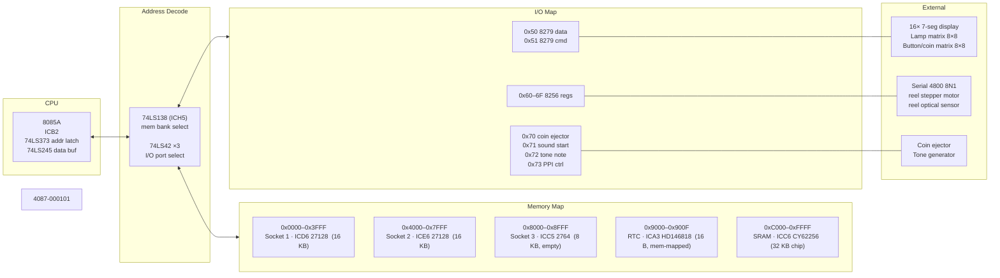

# Die Weiße CPU

Dies ist ein Reverse-Engineering Projekt fuer die "Elektronische Steuereinheit" von adp.

Bei 4040 Platinen sind die IO Adressen anders verteilt:

| IO | Ports |
| ---- | ----------------|
| 0x70-0x73 | 8255: Auswerfer+Zähler+Sound |
| 0x80-0x81 | 8279: Lampen+Tasten |
| 0x90-0x9f | 8256: Timer+Seriell+Walzen |

Aus diesem Grund sind die Programme nicht mit beiden Platinen kompatibel.
Die Lampen und Timer würden ohne Anpassung nicht funktionieren.
